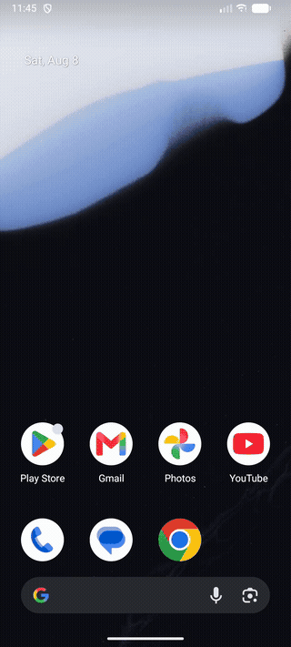

# Ad Skipper — 本地模型开屏广告跳过

[](https://github.com/madeye/ad-skipper/actions/workflows/ci.yml)

基于 Android 无障碍服务的开屏广告自动跳过应用，全部检测在本地完成。
签名 APK 可在 [Releases](https://github.com/madeye/ad-skipper/releases) 直接下载。
检测采用分层降级策略：

| 层级 | 方式 | 典型延迟 | 适用场景 |
|---|---|---|---|
| L1 | 无障碍节点文本匹配（跳过 / Skip / skip_ad…） | <10ms | 原生 UI 的大多数 App |
| L2 | ML Kit 本地中文 OCR | ~100ms | Flutter / Unity / 游戏等无 UI 树的 App |
| L3a | 内置 YOLO11n 跳过按钮检测器（ncnn Vulkan + CPU/NEON 回退，~5MB） | ~20-300ms | 倒计时圆环、混淆按钮、纯图片按钮 |
| L3b | 本地 VLM Grounding（llama.cpp + GGUF，需下载） | ~2-4s | YOLO 未命中的疑难场景兜底 |

命中即短路，L2/L3 只有在前一层未命中时才执行；命中后通过无障碍手势模拟点击。

## 演示



模拟器录屏（`docs/demo.mp4` 为原始视频）：冷启动 App 后连续打开两次内置的
模拟开屏广告（首页 → 模拟广告测试，右上角为 跳过 30 倒计时按钮），
无障碍服务约 1 秒内自动点击跳过并返回首页。真机效果见 v1.0 release notes。

## 工程结构

```
buildSrc/          # setupCommon/setupCore/setupApp 构建约定
core/              # Android library：无障碍服务、检测管线、VLM JNI、模型管理、数据层
  src/main/cpp/    # llama.cpp（vendored）+ ncnn（prebuilt）+ vlm_jni.cpp + yolo_jni.cpp
mobile/            # 应用模块：Compose UI（首页/设置/模型/统计）+ 模拟广告测试页
```

## 构建

1. 准备 Android SDK / NDK / CMake（`local.properties` 配置 `sdk.dir`）。
2. 拉取 llama.cpp 源码（已 gitignore，体积大）：

   ```bash
   git clone --depth 1 https://github.com/ggml-org/llama.cpp.git core/src/main/cpp/llama.cpp
   # GitHub 不通时可用镜像：
   # git clone --depth 1 https://gitee.com/mirrors/llama.cpp.git core/src/main/cpp/llama.cpp
   ```

3. 下载 ncnn Android 预编译库（YOLO 检测器用，已 gitignore）：

   ```bash
   gh release download 20260526 -R Tencent/ncnn -p ncnn-20260526-android-vulkan.zip
   unzip ncnn-20260526-android-vulkan.zip
   mv ncnn-20260526-android-vulkan core/src/main/cpp/ncnn
   ```

4. 构建并安装：

   ```bash
   ./gradlew :mobile:assembleDebug
   adb install -r mobile/build/outputs/apk/debug/mobile-debug.apk
   ```

依赖仓库官方源在前、阿里云镜像兜底，国内可直接构建。每次 push / PR 的
CI（GitHub Actions，`.github/workflows/ci.yml`）会跑单元测试并完整构建
APK（Linux runner 上从源码安装 Vulkan/SPIRV 头文件、用 NDK 自带 glslc，
llama.cpp/ncnn 按上述步骤自动拉取），构建产物以 artifact 形式留存。

## GPU 推理

llama.cpp 编译时开启 `GGML_VULKAN=ON`：推理通过 ggml Vulkan 后端把全部层
offload 到 GPU（JNI 侧 `n_gpu_layers=99`，mtmd `use_gpu=true`），设备无
Vulkan 时自动回退 CPU，无需额外配置。

Host 端编译依赖（macOS）：

```bash
brew install vulkan-headers spirv-headers shaderc   # glslc 由 shaderc 提供
```

交叉编译的细节都在 `core/src/main/cpp/CMakeLists.txt`：

- Vulkan 头文件取自 Khronos Vulkan-Headers（macOS 用 Homebrew，Linux 装到
  `/usr/local`），而非 NDK sysroot——
  ggml-vulkan 需要的 `vulkan/vulkan.hpp` NDK 不自带；只有 `libvulkan.so`
  从 NDK 对应 `ANDROID_PLATFORM_LEVEL` 的 API 目录取用。
- `vulkan-shaders-gen`（编译期生成 shader 的 host 工具）由嵌套 CMake
  （ExternalProject）构建，继承了 Ninja generator 却不继承含 ninja 的
  PATH，因此生成的 `vk-host-toolchain.cmake` 会把 `CMAKE_MAKE_PROGRAM`
  固定为 SDK 自带的 ninja，编译器固定为 host clang。
- `SPIRV-Headers_DIR` 指向 Homebrew 安装的 SPIRV-Headers cmake 包。

`core/src/main/cpp/patches/*.patch` 下的本地补丁会在 CMake configure 阶段自动
应用到 vendored 的 llama.cpp 源码上，无需手动打补丁。

在 Android 模拟器上测试 GPU 推理时，启动参数必须加 `-gpu host -feature Vulkan`；
否则模拟器默认给客户机的是 SwiftShader（CPU 类型）Vulkan 设备，ggml-vulkan 会拒绝
该设备并静默回退到 CPU 推理。

## 使用

1. 打开 App，按首页引导开启无障碍服务（设置 → 无障碍 → 广告跳过）。
2. 默认 L1/L2/L3 全部开启：L3 首先运行内置的 YOLO11n 跳过按钮检测器
   （在 2026-08 grounding 基准上 19/20 命中、0 次误点 CTA，超过 1.5GB 级
   VLM，见 [vlm-bench REPORT](https://github.com/madeye/vlm-bench/blob/main/REPORT.md)），无需下载。
   检测器跑在 ncnn 上（Vulkan compute，无 Vulkan / 驱动异常时自动回退
   CPU/NEON），模型为 Ultralytics 官方 NCNN 导出（fp16，约 5MB，val 集
   mAP50 0.992）。
   开屏窗口期（应用会话开始后 8 秒内）由固定节奏轮询驱动：跳过启动过渡的
   前 500ms（OEM 启动窗口显示的是上次会话的快照）后每 750ms 跑一遍管线，
   命中后下个周期复查、未消失则重试（每会话最多 3 次点击）——开屏广告
   往往在启动过渡后才渲染且不发无障碍事件，靠事件驱动会整场错过。
   窗口期外仅事件驱动的 L1/L2 关键词层生效，图像层不运行，避免在普通界面误点。
   服务同时以前台服务（specialUse 类型 + 常驻静默通知）保活，降低被
   OEM 后台清理误杀的概率。
3. 可选兜底：「模型」页可下载 VLM 处理 YOLO 未命中的疑难场景。推荐
   InternVL3 2B（Q4_K_M + Q8_0 mmproj，约 1.5GB，896px 输入 16/20 命中）；
   备选 Qwen2.5-VL 3B（约 2.8GB，672px 输入精度相当）。源：ModelScope，
   失败自动回退 hf-mirror；也支持手动导入 GGUF + mmproj，选中后自动切换。
4. 「设置」页可配置关键词、白名单、调试悬浮窗（命中时显示层级与坐标）。

APK 不内置 VLM（约 52MB，其中 YOLO 检测器约 5MB）；VLM 为可选下载项。

## 模型来源

- 推荐下载：`ggml-org/InternVL3-2B-Instruct-GGUF`（Q4_K_M + Q8_0 mmproj，
  约 1.5GB，896px 输入，基准 16/20 命中，为可用模型中最小）
- 备选：`ggml-org/Qwen2.5-VL-3B-Instruct-GGUF`（约 2.8GB，672px 输入，
  精度相当）；也支持经 SAF 手动导入任意 GGUF + mmproj（自定义模型）
- 下载源 ModelScope 优先、hf-mirror 兜底（huggingface.co 国内不可达），
  模型清单见 `core/src/main/java/com/adskipper/core/model/ModelInfo.kt`
- llama.cpp 侧走 mtmd API（`tools/mtmd`）；构建时 clone 的是最新 master，
  若上游 API 变动需同步调整 `vlm_jni.cpp`。

## YOLO 检测器训练

内置的 L3a 跳过按钮检测器在 [madeye/vlm-bench](https://github.com/madeye/vlm-bench)
中训练与评测（该仓库同时包含选型 VLM 的 grounding 基准与结论，见其
[REPORT.md](https://github.com/madeye/vlm-bench/blob/main/REPORT.md)）。完整流程：

1. **合成数据集**（`gen_yolo_data.py`）：2400 训练 + 240 验证张合成开屏广告，
   随机配色 / 字体 / 版式 / 按钮样式与位置，含硬负样本（倒计时、CTA 按钮、
   「{n}秒后自动进入」等易混文案），约 10% 图完全没有跳过按钮。首轮模型在
   真实界面上 16/16 误报，因此追加约 300 张真实 UI 截图增广作为负样本微调。
2. **训练**：Ultralytics YOLO11n（约 2.6M 参数），640 letterbox 输入；
   `skip_v1` 先在纯合成集上训练，再以负样本微调得到 `skip_v2`
   （15 epochs，batch 32，可在 Apple MPS 上完成）。
3. **评测**（`eval_yolo.py`）：val 集 mAP50 0.992 / P 0.98 / R 0.972；
   grounding 基准 19/20 命中、0 次误点 CTA、宿主 CPU 约 21ms/张，
   优于所测的全部 VLM（含 InternVL3-2B）。
4. **导出**：`yolo export format=ncnn`（fp16，约 5MB）产出
   `yolo.ncnn.param` / `yolo.ncnn.bin`，替换本仓库
   `core/src/main/assets/` 下的同名文件即可生效（输出布局 `[1,5,8400]`，
   坐标为 640 letterbox 像素，解析见 `YoloSkipDetector`）。

注意：训练与评测目前均基于合成数据，真实开屏广告的召回未系统验证；
收集真实截图做微调 / 评测是收益最高的下一步。

## 网络说明

- JVM/Gradle 不读 `*_PROXY` 环境变量；需要代理直连 dl.google.com 的机器请把
  `systemProp.http(s).proxyHost/Port` 写进 **用户级** `~/.gradle/gradle.properties`
  （不要提交到仓库的 `gradle.properties`，否则 CI 与他人构建会被本机代理搞挂）。
- 依赖仓库官方源在前、阿里云镜像兜底；插件仓库只用官方源（阿里云 gradle-plugin 镜像元数据不全）。
- 模型下载走 OkHttp，ModelScope 国内直连，无需代理。

## 测试

```bash
./gradlew :core:testDebugUnitTest   # BboxParser / KeywordMatcher / 管线降级顺序
```

模拟器端到端：安装后打开 App → 设置页开启「自测模式」→ 首页「模拟广告测试」，
观察模拟广告页被自动点击「跳过」并关闭（统计页新增一条记录）。已验证的链路
（2026-08）：模拟器 debug/release（R8）构建下 L1 与 L2（关 L1/L3 后 OCR 命中）、
模拟器 L3a YOLO（自测模式）；真机（Xiaomi 14 / HyperOS）L1、L2、L3a 及真实
开屏广告（脉脉热启动）经开屏轮询成功跳过。

注意：L3b（VLM）链路已通过编译与 llama.cpp mtmd API 对齐验证，但端到端推理
（下载约 1.5GB 模型 + 真机推理）尚未实测，首次使用请先小流量验证。

## 已知限制

- `FLAG_SECURE` 页面（银行等）截图为黑屏，此时只有不依赖截图的 L1 生效。
- L3 已支持 GPU（Vulkan）推理，无 Vulkan 设备时自动回退 CPU（见「GPU 推理」）；
  已加超时（默认 4s）放弃机制；NPU 后端留作后续扩展。
- VLM 效果依赖所选模型，bbox 解析对输出格式做了 0-1 / 0-100 / 0-1000 三种归一化容错。
